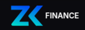

# 📘 Documentação de Aplicação - 

## 🧭 1. [Visão Geral da Aplicação](https://zkfinance.framer.website/)

**Nome do Projeto:** entre-chain-lend — Sistema de Provas ZK para Análise de Crédito

**Problema que resolve:**  
Pequenos empreendedores enfrentam dificuldade de acesso ao crédito, principalmente por não possuírem garantias formais ou precisarem expor dados pessoais sensíveis em processos não transparentes.

**Descrição curta da solução:**  
Uma plataforma descentralizada de empréstimos P2P com verificação de elegibilidade baseada em **provas de conhecimento zero (ZK proofs)**, que permite validar a aptidão de crédito sem revelar o score real do usuário.

**Público-alvo:**  
Empreendedores informais, cooperativas e financiadores descentralizados em ambientes Web3.

**Objetivo principal do MVP (versão atual):**  
Demonstrar a viabilidade de um sistema de empréstimos baseado em provas ZK para validação de crédito, com fluxo funcional entre frontend, backend, agente de score e contrato inteligente.

---

## ⚙️ 2. Funcionalidades do MVP

### Funcionalidade 1 (principal):  
**Geração e verificação de provas ZK de score de crédito**  
- Recebe um score gerado por um agente (N8N) com base em dados reais.  
- Gera localmente uma prova criptográfica que comprova que o score ≥ threshold.  
- Envia essa prova para uma Edge Function do Supabase que utiliza o ZKVerify para validar.  
- O resultado autoriza ou não o acesso ao pedido de empréstimo.

### Funcionalidade 2 (opcional):  
**Interface de financiamento e contrato inteligente**  
- Usuários com perfil de financiador podem visualizar pedidos válidos e interagir com o contrato inteligente (via Viem) para financiar ou acompanhar reembolsos.

---

## 🧪 3. MVP e Critérios de Aceitação

**O MVP está:**  
✅ Funcionando com protótipo clicável na Vercel
✅ Com documentação técnica clara (README + diagramas + pitch)  
✅ Cumpre os critérios mínimos definidos no regulemento do Hakathon 

**Link para o MVP funcional:**  
🔗 [ZKFinance](https://entre-chain-lend.vercel.app)  
📎 [Documentação no GitHub](https://github.com/fsegall/the_lenders)

---

## 🧰 4. Tecnologias e Ferramentas Utilizadas

**Frontend:** React, Viem, Tailwind, ShadCN/UI, Vite, Lovable  
**Backend:** Supabase (PostgreSQL, Auth, Edge Functions), N8N, Circom, SnarkJS  
**Deploy:** Vercel  
**Ferramentas com IA utilizadas:**  
- ChatGPT (planejamento, código, documentação)  
- Lovable (prototipação)  
- Cursor (editor com copiloto de IA)

---

## 📈 5. Aplicação do 80/20

**Principal entrega de valor com menor esforço:**  
- A prova de conceito da verificação de crédito via prova ZK: resultado booleano validado sem expor dados sensíveis.

**Priorização de tarefas:**  
- O circuito ZK e a Edge Function de verificação foram desenvolvidos antes da lógica completa do contrato inteligente, garantindo foco na parte mais inovadora e estratégica.

---

## ♻️ 6. Ciclo de Iteração e Feedback

**Como o grupo testou ou validou a ideia:**  
- Iterações com simulações de prova, ajustes no circuito ZK e mock do verificador local antes da integração final com a interface e API externa.

**Ajustes feitos com base no feedback:**  
- Inclusão de um cronômetro e script de pitch para melhorar a comunicação técnica.  
- Diagrama visual para explicar o fluxo completo do sistema.

**Melhorias futuras:**  
- Implementar reputação composta com múltiplos critérios no circuito.  
- Verificação ZK diretamente no contrato inteligente.

---

## 🧩 7. Estrutura de Time e Divisão de Tarefas

**Integrantes do grupo:**  
- Felipe Segall — Código do MVP full-stack, ideação, ZK, documentação.
- Felix \"Rock\" Rodrigues — Automação, plano de negócios, design, ideação, pitch, documentação.
- Laura Eckeert - UI/UX Designer
- Paulo Marinato — Plano de negócios, análise de ambiente DeFi, oportunidades de monetização, benchmarking e documentação.

**Responsável por enviar a entrega:**  
- Felipe Segall  
  📩 contato: https://linkedin.com/in/fsegall
- Felix Rodrigues
  📩 contato: contatogeneralrock@gmail.com
  

---

## 🖼 8. Identidade Visual

**Arte de perfil do time:**  
a atualizar ...

---

## 🧠 9. Lições aprendidas

**O que a equipe aprendeu com esse desafio:**  
- Como implementar provas ZK com Circom e SnarkJS.  
- Como conectar componentes frontend, backend e smart contracts de forma modular.

**Maior desafio técnico ou criativo:**  
- Gerar e verificar provas ZK de forma confiável com feedback útil para o usuário final.

**O que fariam diferente na próxima sprint:**  
- Integrar reputação on-chain desde o início.  
- Automatizar deploy contínuo entre módulos.
